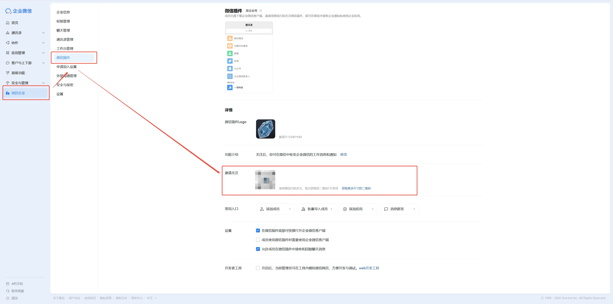

# 企微应用配置指南

本文档详细说明如何在企业微信管理后台创建应用、获取必要配置信息，并完成 IP 白名单设置。

---

## 一、注册企业微信

1. 打开 https://work.weixin.qq.com/ ，点击"企业注册"
2. 选择"企业 / 组织"类型，填写信息完成注册
3. 注册完成后进入管理后台

> 个人也可以注册，选择"我是个人/团队"即可，不需要营业执照。

---

## 二、获取 Corp ID（企业 ID）

1. 登录 [企业微信管理后台](https://work.weixin.qq.com/wework_admin/frame)
2. 左侧菜单：**我的企业** → **企业信息**
3. 页面底部找到 **企业 ID**，复制保存


---

## 三、创建自建应用

1. 左侧菜单：**应用管理** → 页面下方 **自建** 区域 → **创建应用**
2. 填写：
   - **应用 Logo**：随便上传一张图
   - **应用名称**：比如 `Karvis`
   - **可见范围**：选择你要使用的成员/部门
3. 点击"创建应用"


---

## 四、获取 AgentId 和 Secret

创建完成后自动进入应用详情页：

1. **AgentId**：页面上方直接显示，复制保存
2. **Secret**：点击"查看"，企微 app 扫码验证后获取，复制保存


> Secret 只展示一次，建议立即保存到 `.env` 文件。

---

## 五、获取 Token 和 EncodingAESKey

1. 在应用详情页，找到 **接收消息** → 点击 **设置 API 接收**
2. 点击 **随机获取** 分别生成 Token 和 EncodingAESKey，复制保存
3. **URL 先不填**，等 Karvis 服务启动后再回来配置


> 填写 URL 的步骤见 [部署指南 → 连接企微](部署指南.md#连接企微)。

---

## 六、配置企业可信 IP（IP 白名单）

这一步**必须做**，否则 Karvis 能收到消息但无法回复。

### 什么是企业可信 IP

企微要求：应用主动调用 API（如发消息给用户）时，请求来源 IP 必须在白名单中。不在白名单的 IP 调用会被拒绝。

### 配置步骤

1. 在应用详情页，向下滚动找到 **企业可信 IP** 区域
2. 点击 **配置**（首次）或 **修改**


3. 输入你的**服务器公网 IP**，点击确认


### 如何获取服务器公网 IP

```bash
# 在服务器上执行
curl -4 ifconfig.me
```

### 不同部署方式的 IP 配置

| 部署方式 | 填什么 IP |
|----------|-----------|
| 云服务器 | 服务器的公网 IP |
| 本地电脑 + cloudflared | 不需要配（cloudflared 走隧道，IP 是 Cloudflare 的） |
| 本地电脑 + 其他内网穿透 | 穿透服务的出口 IP（看服务商文档） |

> ⚠️ 使用 cloudflared 的用户可以跳过此步。

### 常见问题

**Q：配了 IP 还是回复不了？**

检查顺序：
1. 确认 IP 填的是**公网 IP**，不是内网 IP（`192.168.x.x` / `10.x.x.x` 不行）
2. 确认填的是 Karvis **运行所在机器**的 IP，不是你自己电脑的 IP
3. 检查日志中 `reply_text` 是否有 `IP not in whitelist` 错误
4. 如果服务器 IP 是动态的，每次变化后需要更新白名单

**Q：可以填多个 IP 吗？**

可以，用英文分号 `;` 分隔。适用于多服务器或迁移场景。

---

## 七、配置汇总

完成以上步骤后，你应该拿到这些信息，填入 `.env`：

```bash
WEWORK_CORP_ID=ww1234567890abcdef       # 步骤二获取
WEWORK_AGENT_ID=1000002                   # 步骤四获取
WEWORK_CORP_SECRET=xxxxxxxxxxxxxxxxxxxx   # 步骤四获取
WEWORK_TOKEN=xxxxxxxxxxxxxxxxxxxx         # 步骤五获取
WEWORK_ENCODING_AES_KEY=xxxxxxxxxxxxxxxxx # 步骤五获取
```

然后继续 [部署指南](部署指南.md) 中的部署步骤。

---

## 八、在微信中使用（无需下载企业微信 App）

部署完成后，你可以直接在**微信聊天界面**中使用 Karvis，无需安装企业微信客户端。

### 1. 获取微信插件二维码

1. 登录 [企业微信管理后台](https://work.weixin.qq.com/wework_admin/frame)
2. 左侧菜单：**我的企业** → **微信插件**
3. 在"邀请关注"区域，找到**二维码**，用微信扫描



> 扫码后微信会提示你关注该企业，确认即可。

### 2. 在微信中找到 Karvis

关注成功后，回到**微信聊天列表**：

1. 找到你的**企微团队**（显示为团队名称，如"空空的小团队"）
2. 点击进入团队 → 找到 **KarvisForYou**（或你设置的应用名称）
3. 点击进入聊天页面，就可以开始对话了


> 💡 **小技巧**：长按 Karvis 的聊天 → 「置顶聊天」，这样它会一直在微信聊天列表最上方，随时可以发消息记录。

